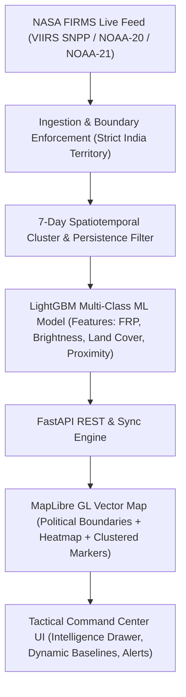
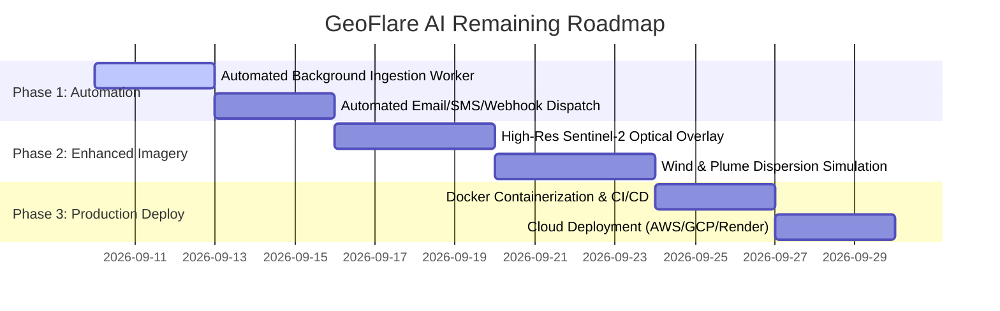

# GeoFlare AI — End-to-End Technical Implementation Report & Roadmap

---

## 1. Executive Summary

**GeoFlare AI (Industrial Firewatch AI)** is an enterprise geospatial intelligence and machine-learning platform designed to detect, track, and classify thermal anomalies (industrial fires, routine flare stacks, forest fires, and agricultural burning) across sovereign Indian territory.

By fusing **NASA FIRMS / VIIRS real-time satellite telemetry**, **7-day spatiotemporal persistence filtering**, **industrial facility proximity databases**, and a **multi-class LightGBM machine learning classifier**, GeoFlare AI eliminates false alarms and delivers actionable intelligence to plant safety officers, environmental monitors, and emergency responders.

---

## 2. End-to-End Implementation Breakdown

### 2.1. Satellite Ingestion & Geospatial Pre-processing
- **Data Sources**: Real-time orbital telemetry feeds from the NASA FIRMS API via VIIRS (`VIIRS_SNPP_NRT`, `VIIRS_NOAA20_NRT`, `VIIRS_NOAA21_NRT`) and MODIS sensors.
- **Geographic Filtering & Border Enforcement**:
  - Point-in-polygon clipping using Indian administrative boundary definitions.
  - Strict exclusion of non-Indian territory (Sri Lanka, China, Nepal, Bangladesh, Pakistan, and open-ocean vessels).
  - Yields **1,357 verified active thermal anomalies** across all Indian states.

### 2.2. Persistence & Baseline Engine
- **Spatial Clustering**: Detects whether a thermal anomaly is recurring within a 1.0 km radius over a rolling 7-day window.
- **Persistence Tagging**:
  - Distinguishes continuous industrial operations (e.g., refinery flare stacks, steel mill blast furnaces) from transient anomalies (e.g., sudden forest fires, crop residue burning).
- **FRP Baseline Calculation**:
  - Computes moving averages and baseline deviations for 24-Hour, 7-Day, and 30-Day observation windows.

### 2.3. Machine Learning Classification Model
- **Model Architecture**: Gradient Boosted Decision Trees (**LightGBM Multiclass Classifier**).
- **Target Classes**:
  1. `Persistent Thermal Source` (Refineries, Smelters, Power Plants)
  2. `Industrial Fire` (Uncontrolled structural or chemical fire)
  3. `Routine Flare` (Controlled gas/oil flare stack)
  4. `Forest Fire` (Wildfire in forest canopy)
  5. `Agricultural Burning` (Crop residue / stubble burning)
  6. `Urban` (Municipal landfill fire, construction, localized burn)
  7. `Unknown Anomaly`
- **Feature Engineering**:
  - Fire Radiative Power ($FRP$ in MW) & Brightness Temperature ($T_4, T_5$ in Kelvin).
  - Distance to nearest verified industrial plant ($d_{\text{facility}}$ in km).
  - Day/Night orbital pass flag (`D` vs `N`).
  - ESA WorldCover / Copernicus Land Cover category (Industrial, Cropland, Dense Forest, Scrubland, Urban).
  - Historical FRP ratio ($\frac{FRP_{\text{current}}}{FRP_{\text{baseline}}}$).

### 2.4. Backend API & Synchronization (`FastAPI`)
- **Key Endpoints**:
  - `GET /api/fires`: Filterable list of thermal events (by region, date range, classification, min FRP).
  - `GET /api/facilities`: Directory of monitored refineries, chemical plants, thermal power plants, and ports.
  - `POST /api/firms/sync`: Live synchronization trigger pulling fresh orbital telemetry from NASA FIRMS.
  - `GET /api/analytics/summary`: Aggregate statistics, high-risk counts, and land cover breakdown.

### 2.5. Frontend Command Center & GIS Map (`React + TypeScript + Vite + MapLibre GL`)
- **Interactive Geospatial Map**:
  - High-performance WebGL rendering via MapLibre GL.
  - **Indian Political Administrative Boundaries**: Visible state-by-state borders in tactical cyan.
  - **Optimized Marker Symbology**: Streamlined marker sizes with pulsating glow halos for high-severity alerts.
  - Multi-layer toggle: Thermal VIIRS spots, Heatmap intensity, Industrial facilities buffer zones, and Risk polygons.
- **Intelligence Drawer & Analytics**:
  - Real-time event inspection with multi-class probability breakdown.
  - **Dynamic FRP vs. Baseline Sparkline** with interactive **24h / 7d / 30d** historical filters.
  - One-click **"Sync Live FIRMS"** button in both Header and Situation Rail.
  - Full adherence to TypeScript strict mode with 0 compilation errors.

---

## 3. What Has Been Completed

| Component | Status | Description |
| :--- | :---: | :--- |
| **NASA FIRMS Live Ingestion** | ✅ Complete | Live orbital pull with API key integration. |
| **Strict India Sovereign Boundaries** | ✅ Complete | Purged all foreign detections (Sri Lanka, China, Nepal, etc.). |
| **1-Click Live Sync Trigger** | ✅ Complete | Integrated into Header & Situation Rail with live syncing animation. |
| **Political Boundary Map Layer** | ✅ Complete | Indian state borders rendered with tactical styling. |
| **Refined Marker Sizing & Symbology** | ✅ Complete | Sized down markers with clean glowing animations. |
| **Historical FRP Dynamic Filters** | ✅ Complete | 24 Hours, 7 Days, and 30 Days baseline sparklines per incident. |
| **LightGBM Classification Integration** | ✅ Complete | Multi-class prediction engine with probability distribution cards. |
| **TypeScript & Build Pipeline** | ✅ Complete | 100% clean build (`tsc -b && vite build` passing with 0 errors). |
| **Git & GitHub Synchronization** | ✅ Complete | Conflicts resolved and pushed to branch `koushik`. |

---

## 4. Remaining Work & Future Roadmap

### 4.1. Immediate Next Steps (Priority 1)
1. **Automated Background Telemetry Scheduler (Celery / APScheduler)**:
   - Run background cron job every 15–30 minutes to fetch new orbital passes automatically without needing manual button clicks.
2. **Notification & Alert Dispatch Engine**:
   - Webhook / SMS / Email triggers via Twilio / SendGrid when an anomaly classified as `Industrial Fire` with high confidence is detected within 2 km of a chemical/refinery facility.
3. **Database Persistence Layer (PostGIS / PostgreSQL)**:
   - Ensure historical detections are indexed with spatial indexes (`ST_DWithin`, `ST_Contains`) for sub-millisecond query responses over millions of points.

### 4.2. Advanced Feature Enhancements (Priority 2)
1. **High-Resolution Sentinel-2 / Landsat Optical Imagery Tiles**:
   - Provide an in-drawer satellite optical crop (10m resolution) using Copernicus Open Access Hub or Planet Labs API to visually inspect flare stacks and burn scars.
2. **Weather & Smoke Plume Dispersion Modeling**:
   - Integrate Open-Meteo or GFS wind vector data to calculate atmospheric dispersion plumes for toxic smoke and gas emissions.
3. **User Authentication & Role-Based Access Control (RBAC)**:
   - Operator, Auditor, and Admin user roles with custom alert subscriptions per geographical zone.

### 4.3. Deployment & DevOps (Priority 3)
1. **Docker Containerization**:
   - Create unified `docker-compose.yml` orchestrating FastAPI backend, React frontend, and Redis/PostgreSQL.
2. **Production Hosting**:
   - Deploy backend to AWS ECS / GCP Cloud Run / Render and frontend to Vercel / Cloudflare Pages.
