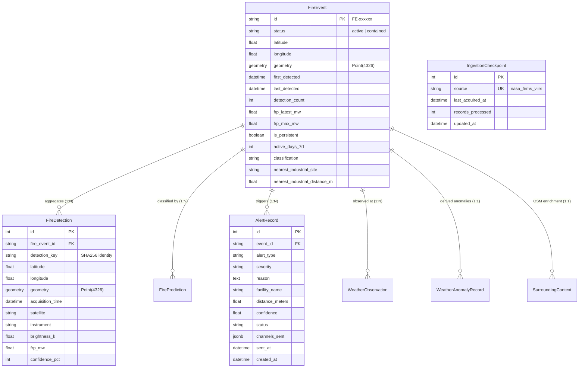

# GeoFlare AI — PostgreSQL / PostGIS Spatial Database Schema & Storage Architecture

## 1. Database Overview

GeoFlare AI uses **PostgreSQL 14+ with PostGIS 3.0+** for geospatial persistence, spatiotemporal clustering, and spatial index searches.

- **Primary Geometry SRID**: `4326` (WGS 84 coordinate reference system: Longitude / Latitude).
- **Spatial Measurement**: Calculations over real-world meter distances cast geometries to `geography` or use geodesic spheroid formulas (`ST_DWithin(..., 500)`).
- **ORM / Migrations**: SQLAlchemy 2.0 with GeoAlchemy2 and Alembic.

---

## 2. Core Entity Relationship & Schema



---

## 3. Detailed Table Specifications

### 3.1 `fire_events` (Spatiotemporal Fire & Thermal Clusters)
- **`id`**: Unique cluster identifier (`FE-000001` or UUID).
- **`status`**: `"active"` | `"contained"`.
- **`latitude`, `longitude`**: Centroid coordinates of the cluster.
- **`geometry`**: PostGIS `Geometry(POINT, 4326)` representing centroid.
- **`first_detected`, `last_detected`**: Earliest and most recent observation timestamps.
- **`detection_count`**: Count of distinct satellite observations merged into this cluster.
- **`frp_latest_mw`, `frp_max_mw`, `frp_mean_mw`**: Radiative power statistics in Megawatts.
- **`brightness_k`**: Latest channel brightness in Kelvin.
- **`is_persistent`**: Boolean flag set by 7-day persistence pre-filter.
- **`active_days_7d`**: Distinct calendar dates with active observations in the preceding 7 days ($0 \le d \le 7$).
- **`nearest_industrial_site`**: OSM name of closest industrial facility.
- **`nearest_industrial_distance_m`**: Distance in meters to closest facility.
- **`inside_industrial_site`**: Boolean indicating if point falls inside an industrial polygon.

### 3.2 `fire_detections` (Raw Satellite Pixel Telemetry)
- **`id`**: Auto-incrementing primary key.
- **`fire_event_id`**: Foreign key to parent `fire_events.id`.
- **`detection_key`**: SHA-256 fingerprint for deduplication.
- **`latitude`, `longitude`**: Pixel coordinates.
- **`geometry`**: PostGIS `Geometry(POINT, 4326)`.
- **`acquisition_time`**: Satellite UTC overpass timestamp.
- **`satellite`**: Satellite platform (`SNPP`, `NOAA-20`, `NOAA-21`, `Aqua`, `Terra`).
- **`instrument`**: Sensor (`VIIRS`, `MODIS`).
- **`brightness_k`, `bright_ti4`, `bright_ti5`**: Dual-channel brightness measurements.
- **`frp_mw`**: Measured Fire Radiative Power (MW).
- **`confidence_pct`**: 0–100% normalized confidence score.

### 3.3 `alert_records` (Audit Log for Dispatched Notifications)
- **`id`**: Auto-incrementing primary key.
- **`event_id`**: Foreign key to `fire_events.id`.
- **`alert_type`**: Type of alert (`industrial_fire`, `facility_proximity_alert`, `persistent_source`).
- **`severity`**: Incident severity (`LOW`, `MEDIUM`, `HIGH`, `CRITICAL`).
- **`reason`**: Explanation detailing confidence, facility distance, and FRP.
- **`facility_name`, `distance_meters`**: Contextual target.
- **`confidence`**: Classifier confidence at alert trigger.
- **`status`**: `"pending"` | `"sent"` | `"failed"` | `"suppressed"` | `"acknowledged"` | `"resolved"`.
- **`channels_sent`**: JSON array of delivered channels (`['webhook', 'sms', 'email']`).
- **`channel_statuses`**: Diagnostic messages from each channel provider.
- **`sent_at`, `created_at`**: Timestamps.

### 3.4 `ingestion_checkpoints` (Incremental Scheduler Tracking)
- **`id`**: Primary key.
- **`source`**: Unique string identifier (`"nasa_firms_viirs"`).
- **`last_acquired_at`**: Timestamp of the latest processed detection.
- **`records_processed`**: Cumulative total records processed.
- **`updated_at`**: Timestamp of latest checkpoint update.

---

## 4. PostGIS Spatial Indexes & Optimization

Spatial indexes are critical to achieve sub-10ms query execution across millions of detections:

```sql
-- Spatial GiST Index on raw detections
CREATE INDEX ix_fire_detections_geom ON fire_detections USING GIST (geometry);

-- Spatial GiST Index on aggregated event clusters
CREATE INDEX ix_fire_events_geom ON fire_events USING GIST (geometry);

-- Temporal + Status composite indexes for active linking window
CREATE INDEX ix_fire_events_status_last_detected ON fire_events (status, last_detected);
CREATE INDEX ix_fire_detections_acquisition_time ON fire_detections (acquisition_time);

-- Checkpoint and Alert indexes
CREATE INDEX ix_alerts_event_created ON alert_records (event_id, created_at);
CREATE INDEX ix_alerts_status ON alert_records (status);
```

---

## 5. Spatiotemporal Event Linking Query

When a new satellite detection arrives at `(d_lat, d_lon, d_time)`:
1. **Search Window**: `status = 'active'` AND `last_detected >= (d_time - INTERVAL '12 hours')`.
2. **Spatial Radius**: Nearest active event within `EVENT_LINK_RADIUS_M = 1000m`.
3. **PostGIS Query**:
   ```sql
   SELECT id, ST_Distance(geometry::geography, ST_SetSRID(ST_MakePoint(:lon, :lat), 4326)::geography) AS dist_m
   FROM fire_events
   WHERE status = 'active'
     AND last_detected >= :window_start
     AND ST_DWithin(geometry::geography, ST_SetSRID(ST_MakePoint(:lon, :lat), 4326)::geography, 1000.0)
   ORDER BY dist_m ASC
   LIMIT 1;
   ```
4. **Action**:
   - If matched: Link detection to existing event, recompute centroid, update `last_detected`, `frp_max_mw`, `frp_latest_mw`, and `detection_count`.
   - If not matched: Create a new `FireEvent` record with initial status `"active"`.

---

## 6. 7-Day Persistence Query

Evaluates the distinct calendar dates with active thermal signatures within 500m over the rolling 7-day window:

```sql
SELECT DISTINCT DATE(acquisition_time AT TIME ZONE 'UTC') AS active_date
FROM fire_detections
WHERE acquisition_time >= :cutoff_time
  AND ST_DWithin(geometry::geography, ST_SetSRID(ST_MakePoint(:lon, :lat), 4326)::geography, 500.0)
ORDER BY active_date ASC;
```
- Active Days Count = `COUNT(active_date)`.
- If `active_days >= 5`: Set `is_persistent = True`, `persistence_status = 'persistent_thermal_source'`, and bypass LightGBM classification.
